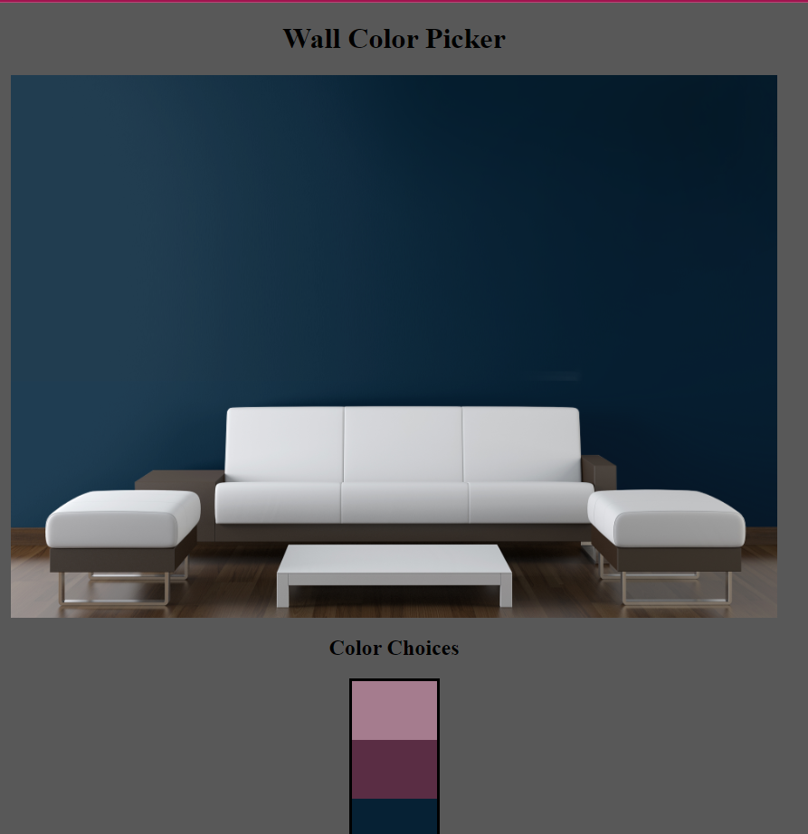

# The Perfect Color

Looking for the perfect color to paint your accent wall and don't want the hassle of driving to the hardware store to pick up color swatches? Look no further! Introducing the perfect color picker. Just click the options available. 

-Disclaimer- Limited colors available and the picture used is for demo purposes only. It's recommended to swatch matches to avoid regret.

## Table of contents

- [Screenshot](#screenshot)
- [Tools](#built-with)
- [Links](#links)
- [Author](#author)

## Screenshot

## Built with

- HTML
- CSS
- JavaScript

## Getting Started

**How to use**

Open with the IDE of choice, right-click on HTML, and open in your preferred browser. Click on available color squares and enjoy your next interior wall color.

## Links

Color Scheme: [Pinterest](https://www.pinterest.com/)

## Author

- LinkedIn - [@avion-cobb](https://www.linkedin.com/in/avion-cobb/)
- Twitter - [@Blvck_Lotus003](https://twitter.com/Blvck_Lotus003)
